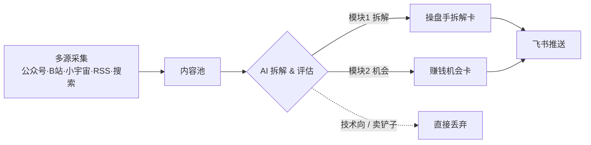

# 一人公司掘金日报 · OPC Gold Daily

> 自动抓取全网「一人公司 / 副业 / 个人IP」赚钱案例，用 AI 拆出**获客方式**和**变现路径**，每天把能照抄的作业推到飞书。

[](https://www.python.org)
[](https://www.feishu.cn)
[]()

## 这是什么

一个**非技术向**的一人公司赚钱机会情报系统。它每天自动运行，从公众号、B站、小宇宙、RSS、搜索引擎、Reddit、Twitter、YouTube 等渠道采集内容，经 AI 拆解与筛选，把**真正能抄的作业**推到飞书群——不是告诉你「有人在赚钱」，而是讲清**他怎么获客、怎么收钱、你第一步该做什么**。

### 为什么做这个

网上的「一人公司」内容大量是写给**会写代码的人**看的（indie hacker、SaaS、自动化工作流）。但很多人**完全不会写代码**，看了也学不会。本系统只保留**非技术**方向：

- 内容 / 自媒体 + 品牌合作
- 信息产品 / 课程 / 训练营
- 付费社群 / 会员 / 陪伴
- 产品化服务 / 代运营

并且**硬剔除卖铲子的人**（教别人赚钱、卖课卖社群，但自己不真正做业务）。

## 每天产出什么

系统分两个模块，各自推送一张飞书卡：

| 模块 | 每天产出 | 说明 |
|------|----------|------|
| 🔍 **操盘手拆解** | 1–2 人 | 拆解一个「隐形超级个体」的商业模式 / 获客 / 实操，**重点讲获客怎么来** |
| 💡 **赚钱机会挖掘** | 约 10 条（国内 5 + 国际 5） | 用「四维度 + 三否决」筛出可复刻的真机会，**剔除卖铲子** |

## 工作流程



## 内容从哪来

- **国内**：公众号（按号名定向监测更新）、B站、小宇宙、中文搜索引擎、精选中文 RSS
- **国际**：Starter Story / Side Hustle Nation / Smart Passive Income / Indie Hackers / Hacker News / Gumroad 等 RSS，以及 Reddit、Twitter、YouTube 频道
- **侦察兵**：每天自动挖掘新的「写一人公司 / 本身是 OPC」的公众号，列入白名单持续追更

## 非技术向保障

- 确定性关键词硬过滤 `is_technical()`：命中「写代码 / 编程 / 独立开发者 / SaaS / AI 工程师」等强技术信号，无论 AI 怎么判都直接丢弃
- 发现引擎 + 机会评估双重把关，只推「无 / 低」技术门槛的内容
- 聚焦**新**的一人公司 / 新 IP / 刚跑通一人模式的人，**不推已成名多年的大V**

## 飞书推送

每天定时（默认北京时间 22:00）推送两张卡：一张深度拆解、一张机会清单（命中优质内容不封顶，自动分批，防截断）。

## 自部署

```bash
git clone https://github.com/wsjxphz-png/opc-gold-daily.git
cd opc-gold-daily
python -m venv .venv && .venv/Scripts/activate   # Windows；mac/Linux 用 source .venv/bin/activate
pip install -r requirements.txt
cp .env.example .env                              # 填入 FEISHU_WEBHOOK_URL 与 AI_API_KEY
python main.py --once                             # 立即跑一次（真实采集 + AI + 推飞书）
python main.py --daemon                           # 定时运行（默认 22:00）
```

也支持 GitHub Actions 定时运行（见 `.github/workflows/daily-push.yml`），密钥放仓库 Secrets（同名变量：`FEISHU_WEBHOOK_URL`、`AI_API_KEY` 等）。

## 检索词 / 标签

一人公司 · 副业 · 赚钱 · 信息差 · 飞书 · 个人IP · 知识付费 · 自媒体 · 轻创业 · side hustle · solopreneur · passive income · content monetization

## 免责声明

- 内容来自公开网络，由 AI 生成摘要与拆解，**不构成任何投资建议**。
- 收入、数字等如未公开会标注「未公开 / 约」，**严禁当作事实**。
- 拆解为「可复制思路」参考，实操请结合自身情况。

## 许可证

MIT
